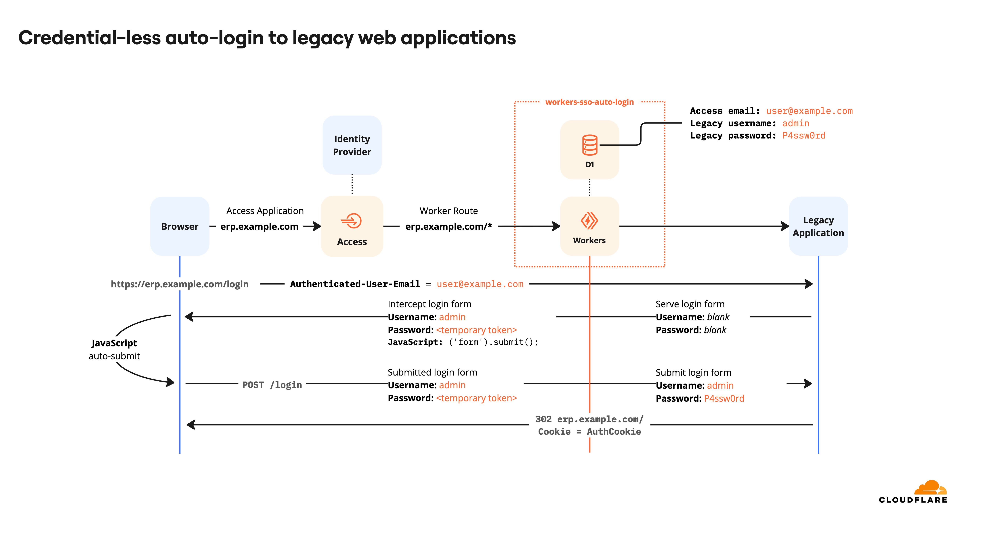
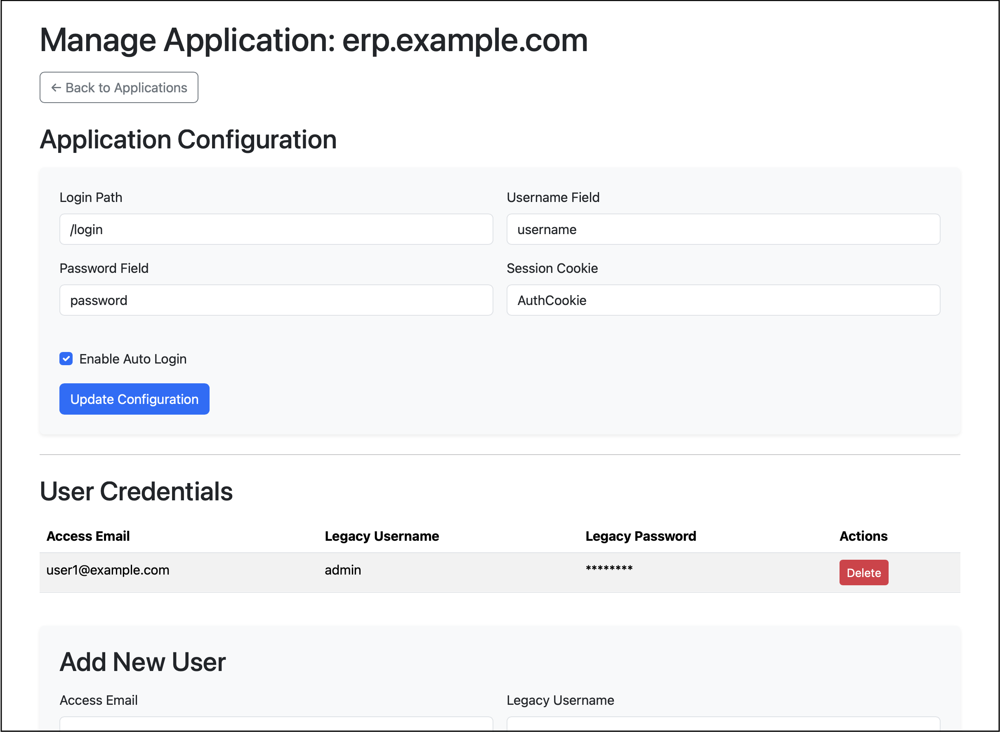
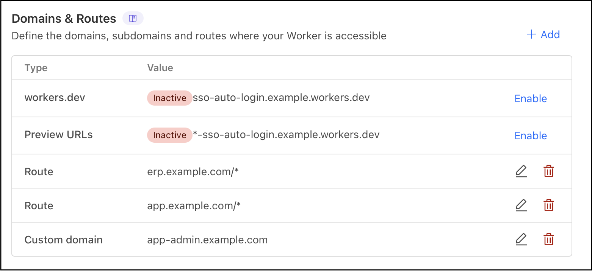

# Cloudflare Worker SSO Credential Injector

**This Worker lets you retrofit SSO onto legacy web apps—no code changes required on the app itself.**

## Overview

This Worker enables seamless Single Sign-On (SSO) for legacy web applications that do not natively support SSO or Cloudflare Access. It bridges Cloudflare Access authentication with legacy username/password logins by automatically mapping Access-authenticated users to their legacy credentials and transparently submitting the login form on their behalf.

Even better, the user trying to log in will not need to know, or will be able to see the password they are logging in with!

## How It Works

The Worker behavior depends on whether auto-login is enabled for each application:

### With Auto-Login Enabled (Recommended)
- When a user accesses the login page, the Worker:
  - Looks up the user's Cloudflare Access email in a D1 database.
  - Directly submits the login form with the mapped legacy credentials without showing the login page.
  - If login succeeds, forwards the response with session cookies to complete authentication.
  - If login fails, returns the error response from the origin.
- The user is seamlessly logged in without seeing or interacting with the login form.

### With Auto-Login Disabled
- When a user accesses the login page, the Worker:
  - Looks up the user's Cloudflare Access email in a D1 database.
  - Auto-fills the login form with the mapped legacy username and a temporary password token.
  - Serves the login page with credentials pre-filled (user can see the form).
- When the login form is `POST`ed:
  - If the password matches the temporary token, the Worker swaps it for the real legacy password from D1 and proxies the POST to the origin.
  - All other form fields are preserved.
  - The Worker ensures session cookies set by the origin are forwarded to the browser.
- All other requests are proxied transparently, unless a valid session cookie is already present.

## Admin Portal

This project now includes a full-featured admin portal that allows you to:

- Manage protected applications
  - Add new applications to protect with SSO
  - Configure login paths, form field names, and session cookies
  - Enable/disable auto-login for each application
- Manage user credentials
  - Map Cloudflare Access emails to legacy credentials
  - Add, view, and delete user mappings
  - Securely store passwords in the D1 database

## Getting Started

### 1. Prerequisites

- [Cloudflare account](https://dash.cloudflare.com/)
- [Cloudflare Access](https://developers.cloudflare.com/cloudflare-one/)
- [Cloudflare Workers](https://developers.cloudflare.com/workers/)
- [Cloudflare D1](https://developers.cloudflare.com/d1/)
- Your legacy app must be behind Cloudflare and protected by Access.

### 2. Deploy the Worker

Use the Deploy button above to deploy the worker. This will create a new D1 database for you, and populate it with the necessary tables.

### 3. Configure the Worker

Set the `ADMIN_HOSTNAME` environment variable in your Worker configuration to the hostname you'd like to use for the admin portal.

Add routes for your legacy applications behind Cloudflare Access, and a Custom Domain for the admin portal in the Worker settings. See for more information, the Cloudflare Developer Documentation on [Worker Routes](https://developers.cloudflare.com/workers/configuration/routing/routes/).

### 4. Configure Cloudflare Access

- Protect your admin portal URL with Access.
- Protect your legacy app's URL with Access.

### 5. Configure Applications and Users via Admin Portal

1. Visit your admin portal at the configured hostname (e.g., `app-admin.example.com`).
2. Add your applications with the following details:
   - Hostname (e.g., `erp.example.com`)
   - Login path (e.g., `/login`)
   - Username field name
   - Password field name
   - Session cookie name
   - Auto-login setting
3. For each application, add user mappings:
   - Access email pattern (supports wildcards with `*`)
   - Legacy username
   - Legacy password

   **Wildcard Pattern Examples:**
   - `user@example.com` - Exact match for specific user
   - `*@example.com` - All users from example.com domain
   - `*` - Universal fallback for any user
   
   More specific patterns take precedence over general ones.

### 6. Test the Integration

- Visit your application's login page.
- If auto-login is enabled: You will be seamlessly logged in without seeing the login form.
- If auto-login is disabled: The login form will appear with credentials pre-filled, and you can submit it to log in.

## Potential Customization

Different applications may use different login forms and field names. The admin portal allows you to configure:

- The login path for each application
- The form field names for username and password
- The session cookie name used by the application
- Whether to auto-submit the login form

## Security Notes

- Passwords are stored securely in D1.
- Note that the temporary password will be available in plaintext in the HTML of the intercepted page. It cannot be used to log in to any application, but is matched on as a 'placeholder' to replace with the real password to the origin.
- Only deploy this Worker for applications where you control both the authentication mapping and the backend.
- Ensure your admin portal is properly protected with Cloudflare Access.

## Troubleshooting

- If login fails, check:
  - The D1 mapping for the user's email.
  - The Worker logs for POST body and header mismatches.
  - Application configuration in the admin portal.
- Compare network requests from manual and Worker-driven logins using browser dev tools.

## References

- [Cloudflare Access](https://developers.cloudflare.com/cloudflare-one/)
- [Cloudflare Workers](https://developers.cloudflare.com/workers/)
- [Cloudflare D1](https://developers.cloudflare.com/d1/)
- [Extend SSO with Workers (Cloudflare Docs)](https://developers.cloudflare.com/cloudflare-one/tutorials/extend-sso-with-workers/)
